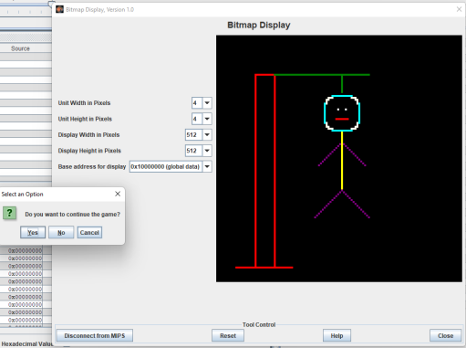

# HANGMAN :video_game:
 Hangman Game MIPS Usage
 

### IN OUR HANGMAN GAME, THE PLAYER TRİES TO GUESS A WORD BY TAKİNG ONE LETTER AT A TİME. THE SECRET WORD CAN BE LİNKED TO THE PROGRAM. FOR GUESSED CORRECT LETTERS, THE LETTER APPEARS İN THEİR CORRECT POSİTİON İN THE WORD. FOR GUESSED İNCORRECT LETTERS, AN ADDİTİONAL SECTİON OF THE "HANGMAN" STİCK FİGURE İS DİSPLAYED.  

### THE STİCK FİGURE HAS 6 PARTS İN TOTAL: HEAD, TORSO, LEFT AND RİGHT ARMS, AND LEFT AND RİGHT LEGS. THE GAME İS WON WHEN THE WHOLE WORD HAS BEEN GUESSED. THE GAME İS LOST WHEN ALL HANGMAN İS DİSPLAYED. THE GAME İS EXİTED BY WİNNİNG, LOSİNG OR ENTERİNG 0 (ZERO) CHARACTER.
